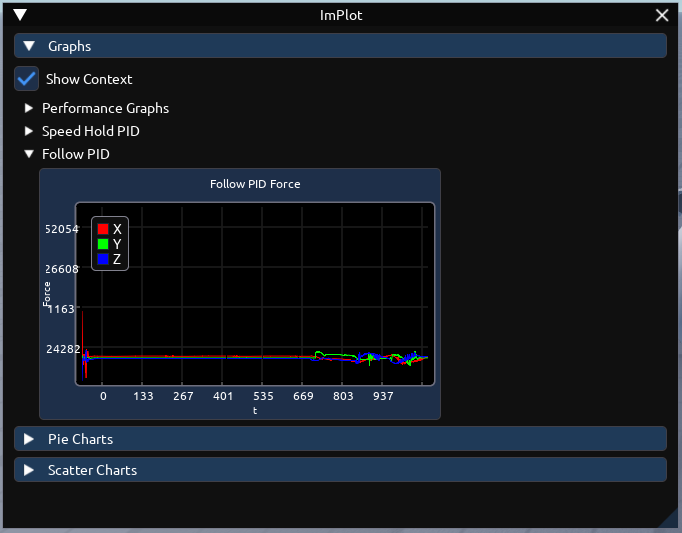
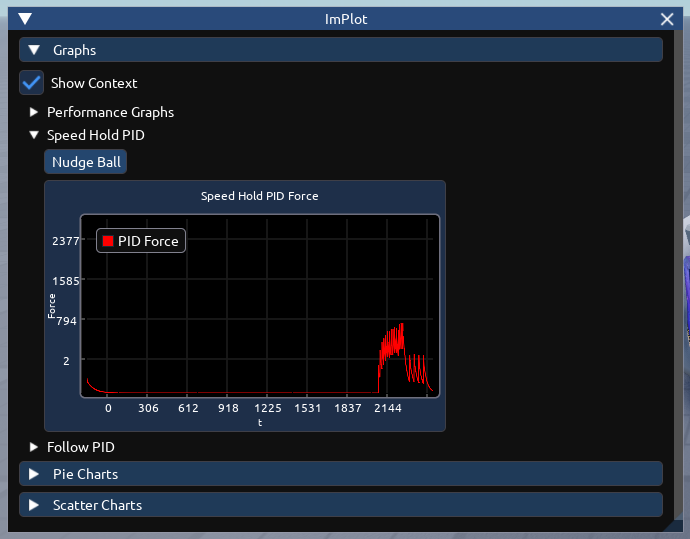
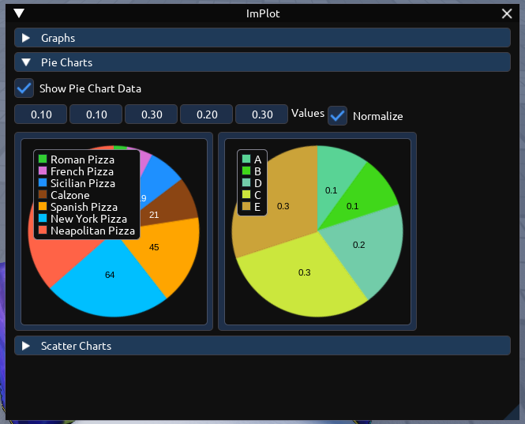
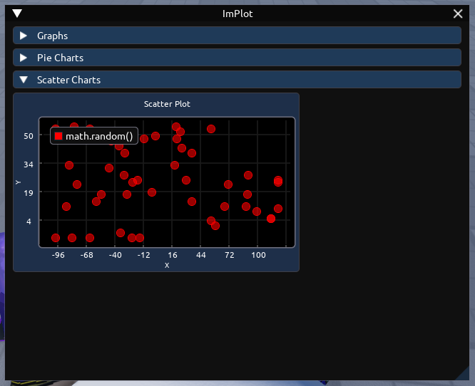

# <span align="left">ImPlot for Iris</span> <a href="https://github.com/LinusKat/ImPlot/releases/"></a>

This is a graphing widget addon based off [ImPlot](https://github.com/epezent/implot), using the open source project [Iris](https://github.com/SirMallard/Iris).

<div align="center">
    <table>
        <tr>
            <td></td>
            <td></td>
        </tr>
        <tr>
            <td></td>
            <td></td>
        </tr>
    </table>
</div>

> Iris is an Immediate-Mode GUI Library for Roblox for creating debug and visualisation UI and tools and based on Dear ImGui.

## Installation

### Wally

Add: `"linuskat/iris-implot` as a dependancy.
```toml
[dependencies]
Iris = "linuskat/iris-implot@1.0.4"
```

### Pre-installed

Download the Iris RBXM/ZIP from [releases](https://github.com/LinusKat/ImPlot/releases).

### Manual

Since Iris does not have the capability to simply add widgets you will need to modify Iris internal files to use the ImPlot addon.

If you are using an external code editor through a tool such as Rojo, I recommend downloading the packaged Iris zip file in [releases](https://github.com/LinusKat/ImPlot/releases).

## Usage

### Graphs

```lua
--!strict
local Iris = require("@self/Iris")

local function Sample(SampleCount: number, Step: number, f: (x: number) -> number): {[number]: Vector2}
	local packed = {}
	for x = 1, SampleCount, Step do
		table.insert(packed, Vector2.new(x, f(x)))
	end
	return packed
end

local SinPacked = Sample(100, .01, math.sin)
local CosPacked = Sample(100, .01, math.cos)

Iris.Init()
Iris.UpdateGlobalConfig(Iris.TemplateConfig.sizeClear)
Iris:Connect(function()
    local show_context = Iris.State(true)
	local plots = Iris.State({})

	Iris.Window({"Graph"}); do
		Iris.Checkbox({"Show Context"}, {isChecked = show_context})

		plots:set{{
			Data = SinPacked,
			Name = "Sin",
			GraphStyle = {
				Color = Color3.new(1, 0, 0),
				Thickness = 1,
			},
		}, {
			Data = CosPacked,
			Name = "Cos",
			GraphStyle = {
				Color = Color3.new(0, 0, 1),
				Thickness = 1,
			},
		}}

        Iris.ImPlotGraph({
            "Sin / Cos",
            { X = "x", Y = "y", XScale = 1, YScale = .8 }},
            {plots = plots, showDataInformation = show_context}
        )
    end; Iris.End()
end)

```

### Pie Charts

```lua
--!strict
local Iris = require("@self/Iris")

local EuropeanPizzaPreference = {
	{Value = 97, Color = Color3.fromRGB(255, 99, 71), Name = "Neapolitan Pizza"},
	{Value = 19, Color = Color3.fromRGB(30, 144, 255), Name = "Sicilian Pizza"},
	{Value = 7, Color = Color3.fromRGB(50, 205, 50), Name = "Roman Pizza"},
	{Value = 13, Color = Color3.fromRGB(218, 112, 214), Name = "French Pizza"},
	{Value = 45, Color = Color3.fromRGB(255, 165, 0), Name = "Spanish Pizza"},
	{Value = 21, Color = Color3.fromRGB(139, 69, 19), Name = "Calzone"},
	{Value = 64, Color = Color3.fromRGB(0, 191, 255), Name = "New York Pizza"},
}

Iris.Init()
Iris.UpdateGlobalConfig(Iris.TemplateConfig.sizeClear)

Iris:Connect(function()
	Iris.Window({"Pie Chart"}); do
		local show_pie_chart_data = Iris.State(true) -- this will show whether the data of the pie chart is shown.
		Iris.Checkbox({"Show Pie Chart Data"}, {isChecked = show_pie_chart_data})

		Iris.ImPlotPieChart({EuropeanPizzaPreference}, {showPieData = show_pie_chart_data})
	end; Iris.End()
end)
```

### Scatter Charts

```lua
--!strict
local Iris = require("@self/Iris")

local ScatterPlot = {
	Data = {},
	Name = "math.random()",
	MarkerStyle = {
		Shape = "Circle",
		Color = Color3.new(1, 0, 0),
		Size = 10,
		Transparency = .4
	},
}

local RNG = Random.new(os.clock())
for i = 1, 50 do
    table.insert(ScatterPlot.Data,
		Vector2.new(RNG:NextInteger(-100, 100), RNG:NextInteger(0, 50))
	)
end

Iris.Init()
Iris.UpdateGlobalConfig(Iris.TemplateConfig.sizeClear)

Iris:Connect(function()
	local scatter_plot_state = Iris.State({})

	scatter_plot_state:set({ScatterPlot})

	Iris.Window({"Scatter Chart"}); do
		Iris.ImPlotGraph({
			"Scatter Plot",
			{X = "X", Y = "Y", XScale = .9, YScale = .9}},
			{plots = scatter_plot_state}
		)
	end; Iris.End()
end)
```

## API

### `ImPlotGraph` - Graph Widget

```lua
function ImPlotGraph(
	WidgetArguments: {
		GraphName: string?,
		Axes: {
			XScale: number,
			X: string,
			YScale: number,
			Y: string,
		},
	},

	WidgetStates: {
		showDataInformation: State<boolean>,
		size: State<Vector2>,
		plots: State<{
			{
				Data: {Vector2},
				Name: string?,
				MarkerStyle: { -- Include when scatter plot | Customization for scatter plot
					Shape: Shape,
					Color: Color3,
					Size: number,
					Transparency: number,
				}?,
				GraphStyle: { -- Include when graph plot | Customization for graph lines
					Color: Color3,
					Thickness: number,
				}?,
			}
		}>,
	}
)
```

### `ImPlotPieChart` - Pie Chart Widget

```lua
function ImPlotPieChart(
	ChunkDataContainer: Frame,
	PieChart: any,

	WidgetArguments: {
		pieData: {
			Color: Color3?,
			Value: number,
		},
	},

	WidgetStates: {
		showPieData: State<boolean>,
		normalize: State<boolean>,
	}
)
```

## Credits

- ImPlot Documentation - [@vijarsan](https://github.com/vijarsan)
- [Iris](https://github.com/SirMallard/Iris) - Maintained by [@SirMallad](https://github.com/SirMallard)
- [Maid](https://github.com/Quenty/NevermoreEngine/blob/main/src/maid/src/Shared/Maid.lua) - Maid by [Quenty](https://github.com/Quenty)
- Based off [ImPlot](https://github.com/epezent/implot)
